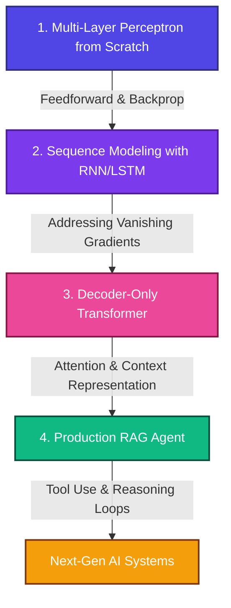

# 🚀 The Evolution Path: From Neural Networks to RAG and AI Agents

This document serves as the guide map for this portfolio. It outlines why we start from the fundamental mathematical blocks of neural networks and how each milestone systematically constructs the capabilities required to build modern Retrieval-Augmented Generation (RAG) and Agentic AI systems.

---

## 📈 The AI Progression Roadmap

To build advanced AI systems that can reason, retrieve context, and execute actions, one must first master how raw parameters learn. Here is the step-by-step evolution of this codebase:



---

## 🧠 Phase 1: Why Did We Start From Scratch?

Before utilizing pre-trained LLMs, embeddings, or Vector DBs, we must understand the core mechanism of deep learning: **gradient-based optimization through backpropagation**. 

Building a **Multi-Layer Perceptron (MLP)** from scratch using only Python and NumPy ensures that:
* **No Black Boxes:** We do not rely on PyTorch or TensorFlow for automatic differentiation (`autograd`). We derive the matrix calculus and implement the forward/backward passes mathematically.
* **Low-Level Mastery:** We solve real-world numerical challenges, such as:
  * **Numerical Stability:** Implementing Softmax using input shifting ($\mathbf{x} - \max(\mathbf{x})$) to prevent floating-point overflow.
  * **Optimized Backward Passes:** Mathematically consolidating the Softmax derivative and Categorical Cross-Entropy loss derivative into a single, clean backward step: $\frac{\partial \mathcal{L}}{\partial \mathbf{z}} = \mathbf{p} - \mathbf{y}$.
  * **Momentum Updates:** Building velocity tracking in Stochastic Gradient Descent (SGD) to accelerate convergence.

---

## ⚙️ Running the Code: Does it Run & What Happens?

Yes! The core MLP is fully functional. It can be run in two modes:

### 1. Verification Test Mode
Run this to verify the pipeline on a lightweight synthetic dataset in seconds:
```bash
python projects/1_neural_network_scratch/neural_network_scratch.py --test-run
```

### 2. Full Training Mode
Runs a training loop on a slice of the Shakespeare corpus ([data/shakespeare.txt](data/shakespeare.txt)), learning to predict the next character of the text from a fixed 10-character window:
```bash
python projects/1_neural_network_scratch/neural_network_scratch.py
```

### 🔍 Inside the Run: Step-by-Step Execution Flow
When the script executes, the following loop occurs for each batch of data:

1. **Parameter Initialization:**
   * Weights ($\mathbf{W}$) are initialized as small random values (scaled by 0.01) to keep activations small at the start of training. Biases ($\mathbf{b}$) are set to zero.
2. **Forward Pass:**
   * **Dense Layer 1:** Inputs are projected: $\mathbf{Z_1} = \mathbf{X}\mathbf{W_1} + \mathbf{b_1}$.
   * **ReLU Activation:** Applies element-wise non-linearity: $\mathbf{A_1} = \max(0, \mathbf{Z_1})$.
   * **Dense Layer 2:** Second projection to class scores: $\mathbf{Z_2} = \mathbf{A_1}\mathbf{W_2} + \mathbf{b_2}$.
3. **Loss & Softmax Activation:**
   * Probabilities ($\mathbf{p}$) are computed via Softmax, and loss is calculated via Categorical Cross-Entropy.
4. **Backward Pass (Backpropagation):**
   * Gradients are calculated in reverse order using the chain rule:
     $$\frac{\partial \mathcal{L}}{\partial \mathbf{Z_2}} = \mathbf{p} - \mathbf{y}$$
     $$\frac{\partial \mathcal{L}}{\partial \mathbf{W_2}} = \mathbf{A_1}^T \cdot \frac{\partial \mathcal{L}}{\partial \mathbf{Z_2}}$$
     $$\frac{\partial \mathcal{L}}{\partial \mathbf{A_1}} = \frac{\partial \mathcal{L}}{\partial \mathbf{Z_2}} \cdot \mathbf{W_2}^T$$
     * Gradient is propagated through ReLU, and then through the first Dense layer parameters ($\mathbf{W_1}, \mathbf{b_1}$).
5. **Parameter Optimization (SGD with Momentum):**
   * Weight and bias parameter values are adjusted in the direction that minimizes loss, accelerated by momentum memory.
6. **Logging:**
   * Epoch metrics (Loss, Accuracy, and Learning Rate) are reported for both training and validation sets to ensure the network is learning.

---

## 🛤️ The Progression Path to RAG & AI Agents

Each milestone builds directly upon the concepts mastered in the previous one:

### 1. Neural Network from Scratch (MLP)
* **Goal:** Understand backpropagation, parameter matrices, activations, and basic optimization.
* **Limitations:** Static input size. It cannot process sequential data (like text) where the length varies.

### 2. Sequence Modeling with RNN & LSTM
* **Goal:** Process variable-length text sequences by introducing **recurrence** and **hidden states** (memory).
* **Evolution:** We custom-build RNN and LSTM layers to solve the *vanishing gradient problem* in sequential datasets.
* **Limitations:** Sequential execution prevents parallelization, and memory degrades over long contexts.

### 3. Decoder-Only Transformer (Scratch GPT)
* **Goal:** Eliminate recurrent processing by using **Self-Attention** and **Causal Masking**.
* **Evolution:** Implement multi-head attention blocks, positional encodings, and residual layers. This architecture enables parallel training on massive text corpora and forms the foundation of modern Large Language Models (LLMs).
* **Limitations:** The LLM's knowledge is static and frozen at the time of training. It cannot access live external databases or reason dynamically.

### 4. Production RAG Agent
* **Goal:** Take the pre-trained Transformer (LLM) and integrate it with external ecosystems.
* **Evolution:** Build a Retrieval-Augmented Generation (RAG) system with a local Vector Database to provide dynamic context, combined with tool-execution loops (AI Agent) that retrieve documents, call APIs, and reason step-by-step.

---
*This evolution represents the transition from understanding basic matrix arithmetic to engineering complex autonomous systems.*
