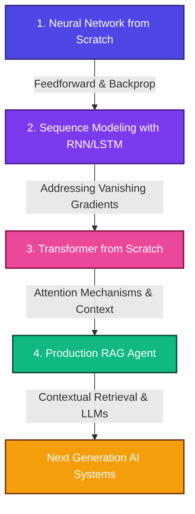

# Evolution to AI Agents from ML

Welcome to my **Evolution to AI Agents from ML** portfolio. This repository showcases my technical progression from building core mathematical foundations from scratch to developing state-of-the-art transformer architectures and production-level Agentic AI applications.

Each folder in this repository represents a major milestone in modern machine learning, complete with custom implementations, clean PyTorch/NumPy code, and comprehensive explanations.

---

## 📈 The Evolution of Sequence Modeling & AI



---

## 📂 Project Directory Structure

### 🧠 [1. Neural Network from Scratch](projects/1_neural_network_scratch/)
* **Focus**: Backpropagation, Vectorization, NumPy-only.
* **Overview**: A Multi-Layer Perceptron (MLP) built completely from scratch using Python and NumPy — no PyTorch, no TensorFlow. Implements full forward/backward propagation, custom activation functions (Sigmoid, ReLU, Softmax), and trains on the MNIST handwritten digits dataset. All gradients are derived and coded by hand.

### 🔄 [2. Sequence Modeling with RNN & LSTM](projects/2_rnn_lstm_generator/)
* **Focus**: Sequence modeling, Hidden States, Recurrence, PyTorch.
* **Overview**: A character-level language model that trains on text and generates new sequences. Implements both a standard RNN and an LSTM in PyTorch so you can directly compare how gating mechanisms fix the vanishing gradient problem. Includes temperature-scaled sampling for controlling output creativity.

### ⚡ [3. Decoder-Only Transformer from Scratch](projects/3_transformer_scratch/)
* **Focus**: Self-Attention, Multi-Head Attention, PyTorch.
* **Overview**: A mini-GPT built block-by-block in PyTorch. Implements multi-head causal self-attention, learned positional encodings, Pre-LN layer normalization, and residual connections. Trained on Shakespeare text and generates new sequences using top-k + temperature sampling.

### 🤖 [4. RAG AI Agent](projects/4_rag_agent/)
* **Focus**: Retrieval-Augmented Generation, Vector DBs, Agents, LLM Integration.
* **Overview**: A production-style RAG agent that indexes documents into a custom TF-IDF vector database (built from scratch in NumPy), retrieves relevant context for a query, and routes the prompt to either a local fallback engine or the Gemini API for generation. Designed to return grounded, fact-verified answers.

---

## 🌐 Interactive Visual Portfolio
To see these architectures in action, check out the interactive web dashboard!
- Open the [Interactive Portfolio Webpage](portfolio-website/index.html) in your browser.
- It includes step-by-step simulations of a feed-forward pass, an RNN text-unrolling process, and a real-time Multi-Head Attention weights visualizer.

---

## 🛠️ Getting Started & Local Verification

To run and verify the codebase locally:

1. **Clone the repository**:
   ```bash
   git clone https://github.com/shabeeehtesham/evolution-to-ai-agents-from-ml.git
   cd evolution-to-ai-agents-from-ml
   ```

2. **Install dependencies**:
   ```bash
   pip install torch numpy torchvision requests
   ```

3. **Verify all projects run successfully**:
   We have included `--test-run` flags for every project script to verify the math and pipelines on lightweight synthetic datasets in seconds:
   ```bash
   # Test MLP from Scratch
   python projects/1_neural_network_scratch/neural_network_scratch.py --test-run

   # Test LSTM Text Generator
   python projects/2_rnn_lstm_generator/char_rnn_generator.py --test-run

   # Test Transformer from Scratch
   python projects/3_transformer_scratch/mini_transformer_gpt.py --test-run

   # Test RAG Agent
   python projects/4_rag_agent/rag_agent.py --test-run
   ```

---

*Created as a display of deep theoretical foundations and practical modern AI implementation skills.*
