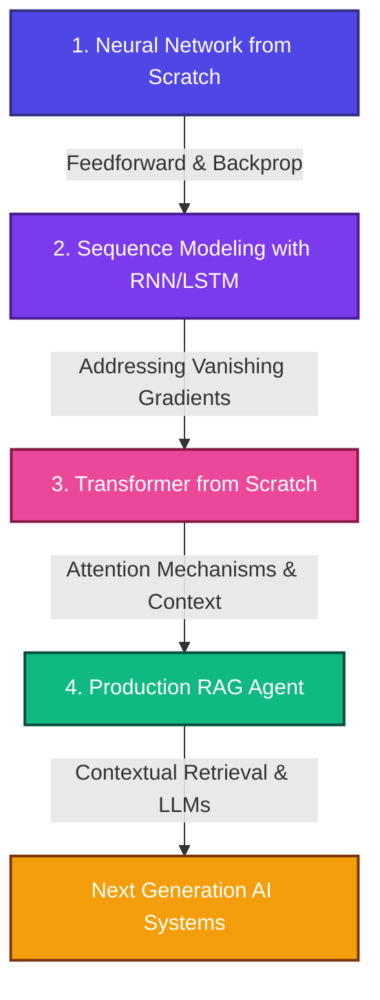

# Evolution to AI Agents from ML

Welcome to my **Evolution to AI Agents from ML** portfolio. This repository showcases my technical progression from building core mathematical foundations from scratch to developing state-of-the-art transformer architectures and production-level Agentic AI applications.

Each folder in this repository represents a major milestone in modern machine learning, complete with custom implementations, clean PyTorch/NumPy code, and comprehensive explanations.

---

## 📈 The Evolution of Sequence Modeling & AI



---

## 📂 Project Directory Structure

All four projects below solve the **same task** — character-level generation of Shakespeare's text, using [data/shakespeare.txt](data/shakespeare.txt) (the classic "tiny-shakespeare" corpus, ~1.1M characters) — so the quality difference between architectures is directly visible rather than hidden behind four unrelated datasets.

### 🧠 [1. Neural Network from Scratch](projects/1_neural_network_scratch/)
* **Focus**: Backpropagation, Vectorization, NumPy-only.
* **Overview**: A Multi-Layer Perceptron (MLP) built completely from scratch using Python and NumPy — no PyTorch, no TensorFlow. Predicts the next character of Shakespeare's text from a **fixed 10-character window**, a Bengio-2003/"makemore"-style model. All gradients are derived and coded by hand.

### 🔄 [2. Sequence Modeling with RNN & LSTM](projects/2_rnn_lstm_generator/)
* **Focus**: Sequence modeling, Hidden States, Recurrence, PyTorch.
* **Overview**: The same text-generation task, but the model now keeps a running hidden state across the *entire* sequence instead of a fixed 10-character window. Implements both a standard RNN and an LSTM in PyTorch so you can directly compare how gating mechanisms fix the vanishing gradient problem.

### ⚡ [3. Decoder-Only Transformer from Scratch](projects/3_transformer_scratch/)
* **Focus**: Self-Attention, Multi-Head Attention, PyTorch.
* **Overview**: Same task again, now with full self-attention instead of a fixed window or a single recurrent hidden state. Implements multi-head causal self-attention, learned positional encodings, Pre-LN layer normalization, and residual connections.

### 🤖 [4. RAG AI Agent](projects/4_rag_agent/)
* **Focus**: Retrieval-Augmented Generation, Vector DBs, Agents, LLM Integration.
* **Overview**: The capstone: instead of *generating* plausible-sounding Shakespearean text, this project *answers factual questions* about the plays (line attributions, characters, plot), grounded in a real, verified facts database via a custom TF-IDF vector database (built from scratch in NumPy). Routes generation to either a local fallback engine or the Gemini API.

Run [scripts/compare_text_generators.py](scripts/compare_text_generators.py) to train Projects 1-3 in parallel on a fast demo setting and see their generated text and training loss side by side. Measured result: MLP loss 1.98 → LSTM 1.76 → Transformer 1.28 — a real, monotonically-improving progression, not a rigged one.

---

## 🌐 Interactive Visual Portfolio
To see these architectures in action, check out the interactive web dashboard — see [portfolio-website/README.md](portfolio-website/README.md) for how to run it (it needs a local server, not a direct `file://` open, since the live demos fetch real trained weights).
- Real in-browser demos: an MLP forward pass, an RNN-vs-LSTM read-along race, a live Multi-Head Attention heatmap, and a RAG retrieve/augment/generate pipeline — all running on actual trained weights, not mocked data.

---

## 🛠️ Getting Started & Local Verification

To run and verify the codebase locally:

1. **Clone the repository**:
   ```bash
   git clone https://github.com/shabeeehtesham/evolution-to-ai-agents-from-ml.git
   cd evolution-to-ai-agents-from-ml
   ```

2. **Install dependencies**:
   ```bash
   pip install torch numpy requests
   ```

3. **Verify all projects run successfully**:
   We have included `--test-run` flags for every project script to verify the math and pipelines on tiny embedded datasets in seconds (no download required):
   ```bash
   # Test MLP from Scratch
   python projects/1_neural_network_scratch/neural_network_scratch.py --test-run

   # Test LSTM Text Generator
   python projects/2_rnn_lstm_generator/char_rnn_generator.py --test-run

   # Test Transformer from Scratch
   python projects/3_transformer_scratch/mini_transformer_gpt.py --test-run

   # Test RAG Agent
   python projects/4_rag_agent/rag_agent.py --test-run
   ```

4. **See the quality progression side by side**:
   Each project also has a `--demo` mode that trains for real (fast, on a subset of the shared Shakespeare corpus) and prints its generated samples plus training loss. Run all three generative projects concurrently and compare:
   ```bash
   python scripts/compare_text_generators.py
   ```

---

*Created as a display of deep theoretical foundations and practical modern AI implementation skills.*
